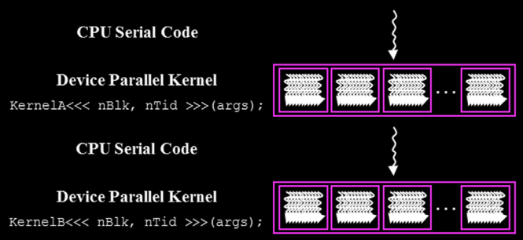
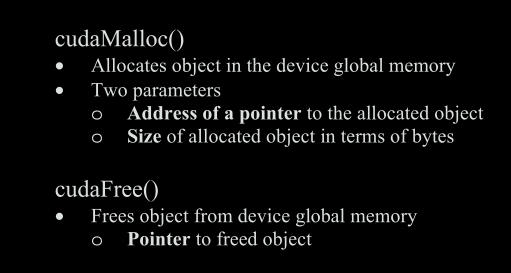
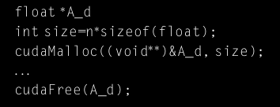
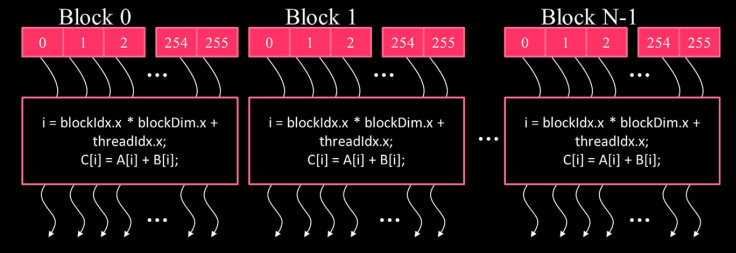
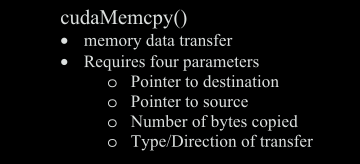
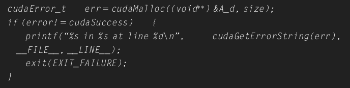
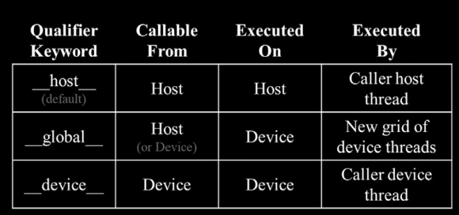
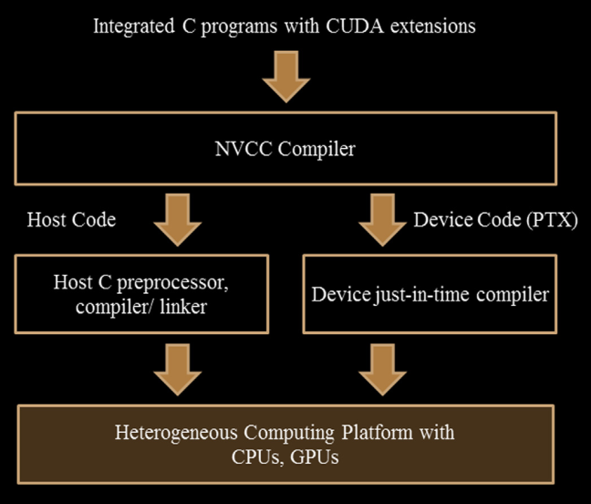

# Heterogeneous data parallel computing

* idea of writing data parallel code: focus on chunks of data while solving the bigger problem in parallel
* develop parallel thinking necessary to find and exploit data parallelism.
* task **parallelism** e.g. performing I/O and data transfer at the same time
* Any C program is a CUDA program with only host code
* The device code includes functions, or kernels, whose code is executed in a data-parallel manner
* Kernels are executed by a large pool of threads and they are collectively called a grid

	
	* Grids -> blocks -> threads
	* In the image you see two grids, each with a pool of threads
* You can assume that threads take very few clock cycles to generate and schedule
* A thread is a sequential execution of a program
* Allocate memory on device -> run the kernel -> return the output to host -> free up memory
* Ideally, keep large and important data structures on the device and simply invoke device functions on them from the host code.
* Devices have their own dynamic random access memory, also called 'device global memory'
* There are other types of memories in the device that are also accessible to programmers besides global memory
* How to allocate/de-allocate memory on device from host code? CUDA runtime provides API
	

	* The address of the pointer variable should be cast to `(void **)` because the memory allocation function expects a generic pointer
	* `cudaMalloc` function writes the address of allocated memory into the provided pointer
	* Host code then passes this pointer value to the kernel that needs to access the allocated memory
	* Function expects: pointer to a pointer to a specific object; this allows `cudaMalloc` to work agnostic to object types
	* How is `cudaMalloc` different from C `malloc`?
		* C `malloc`: returns a pointer to an allocated object
		* Cuda `Malloc`: writes to a pointer variable whose address is given as the first parameter to the function
	 * e.g.
		 
----------------
* `cudaMalloc` assigns the passed pointer the location in the device global memory
* `cudaFree`: returns the allocated memory back to the available pool. It expects the value, not the address of the variable
* now comes `cudaMemcpy`
	 
	* `cudaMemcpy` can be used to copy data from one location in the device global memory to another location in the device global memory, or between host and device memory.
	* For the fourth parameter, two symbolic constants are used:
		1. `cudaMemcpyHostToDevice`
		2. `cudaMemcpyDeviceToHost`
* Stub: Host code that:
	* allocates space on device global memory
	* requests data transfer
	* calls the kernel
* How to check for errors?
	* CUDA API functions return error codes that indicate whether an error has occurred when they served the request
	* Most errors are caused by incorrect argument values used to call the API function
	* e.g. for how error checking can be done
	* 
 ##### Kernel functions
 * some code that is executed by all threads in parallel
 * this style of programming is also called SPMD (single program multiple data)
 * when as a host you call the 'kernel', internally CUDA runtime:
	 * launches a grid of threads
	 * Each grid
		 * is organized in an array of thread blocks (or simply Blocks)
			 * All blocks of a grid are of the same size
				 * each block can contain up to 1024 threads
					 * each thread has a unique index in the block
						 * all threads in a grid execute the same kernel code
		 
	* how much control does the host have over spawning of threads?
		* the total number of threads in a block is specified by the host when launching the kernel
		* The number of threads in a block for a given grid is: 'blockDim'
	* What is `blockDim`?
		* it is a struct with three unsigned ints (x, y, and z)
		* helps in organizing threads in 1D, 2D or 3D array/structure
		* the choice of the organization of threads in 1D, 2D or 3D really depends on the type of data you're working with
		* **organization of threads reflects the organization of data**
			* so if you have a 1D vector, it makes sense for threads to be organized in a 1D array
		* For hardware efficiency, the number of threads in each **dimension** of a thread block should ideally be a multiple of 32
	* What is `threadIdx` and `blockIdx`?
		* All these built-in variables are important to allow threads to focus on a specific area of data that they should work on
		* `threadIdx`: this variable gives each thread a unique coordinate within a block
		* The first thread in each block has a value of 0 in its `threadIdx.x`
	*  The first thread in each block has a value of 0 in its `threadIdx.x` variable, then the second thread has 1, and so on
	* if we suppose that the block dimension is 256. This means that the threads in:
		* Block 0 cover the global index from 0-255
		* Block 1 cover the global index from 256-511
		* Block 2 cover the global index from 512-767
		so basically the indices covered by threads in these three blocks form a continuous range from 0 to 767
	* launching a grid with a larger number of blocks, you can process larger vectors.
	* to process vectors of length n, launch grids with enough threads to cover at least n elements!
	* `__global__` declaration: this tells that the function is a kernel and it can be called to generate a grid of threads on a device.
	* kernels can be called from both device and host. Kernels that are called from host need a `__global__` keyword before them. `__global__` specified kernels that can be called from device allow 'dynamic parallelism'
	* 
	* CUDA dynamic parallelism? Calling a `__global__` kernel from device allows you to launch new grids of threads on the device
	* A device (`__device__`) function executes on a CUDA device and can be called only from a
		* kernel function or
		* another device function
		* NOTE: the device function is executed by the device thread that calls it and does not result in any new set of device threads being launched
	* by default, all functions in a CUDA program are host functions
	* you can declare a function to be both `__global__` and `__device__`, then the compiler will generate two versions of object code for the same function

KEY IDEA: all threads execute the same kernel code and each thread directs itself to a particular part of the data
* hardware registers? small, fast storage locations directly inside the GPU, threads can access and store data they need during parallel execution
* hardware registers are much faster than global or shared memory
* Automatic variables? also local variables, they are private to each thread
* loop parallelism? replace loops with threads, each thread is a single iteration of a loop
* what are the things inside the `<<< --- >>>`? they are called execution configuration parameters
* the number of thread blocks depends on the length of vector $n$ you are working with
* each thread block works on a different part of the vector, DO NOT make any assumption about the execution order
* There is an overhead of allocating device memory and transferring data between host and device
* Real applications keep the data in device memory across multiple kernel invocations to reduce the overhead
##### Compilation
NVCC (Nvidia C compiler)
	
* `cudaMalloc`, `cudaFree`, and `cudaMemcpy` functions are called by the host code to allocate "Device Global Memory." This distinction of memory type is important to understand.