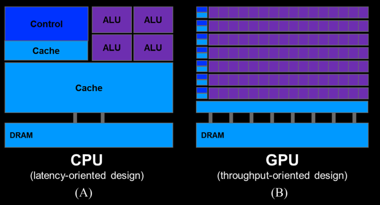
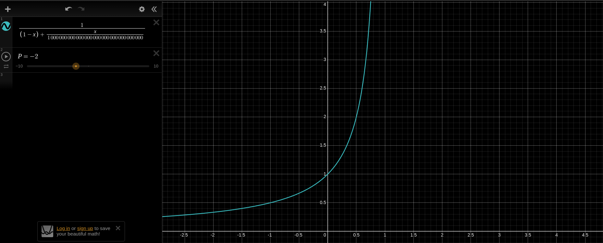

# Chapter 1: Introduction to Parallel Computing
* After reaching the performance limits of single-core CPUs, there was a shift to using multiple physical CPUs.
* Multiple CPUs imply having multiple processor cores.
* Multiple processor cores can execute multiple instructions simultaneously.
* Application workloads are divided into chunks that can be executed in parallel on multiple cores.
* Sequential, step-by-step execution of a program is called a *thread of execution*, or simply a thread.
* During sequential program execution, a 'program counter' stores the memory address of the next instruction.
* Parallel program:
    * Multiple threads execute concurrently to complete a task.
* Two main trajectories for designing microprocessors:
    * ***Multi-core:*** A design that maintains the execution speed of sequential programs while distributing workloads across multiple cores. For example:
        * Playing a video game (primarily uses one core).
        * Streaming music (can use another core).
        * Downloading files (handled by yet another core).
        * Running a virus scan (using a fourth core).
    * ***Many-thread:*** A design focused on 'parallelizable' applications, leveraging multiple threads to increase throughput.
* FLOPS (Floating-point Operations Per Second): Measures the number of floating-point operations performed per second.
    
    * CPUs prioritize reducing the execution latency of a single thread, whereas GPUs prioritize high throughput of floating-point operations and memory accesses.
    * Reducing latency is much more expensive than increasing throughput in terms of power and chip area.
    * This design implies that for tasks not requiring a large number of threads, CPUs are preferable to GPUs due to their lower latency.
    * This motivates the use of CPUs for sequential tasks and GPUs for numerically intensive work.
    * This introduces technologies like CUDA (Compute Unified Device Architecture).
* Decision Factors when choosing processors for running applications:
    * Speed
    * Installed base
    * Form factor
    * Accessibility
* How to compute speedup between two computing systems?
    * Computing System A
    * Computing System B
    * Running the same application, System A takes 10 seconds, and System B takes 200 seconds.
    * $Speedup = T_B/T_A = 200/10 = 20x$
##### Amdahl's Law
Overall speedup of a program is limited by the sequential portion of the program.
$$ S = \frac{1}{(1 - P)+ \frac{P}{N}}  $$
$S$: Overall speedup of the program
$P$: Portion of the program that can be parallelized (fraction)
$N$: Speedup achieved in the parallel portion

**Memory-Bound Application**: An application whose execution speed is limited by memory access latency and/or throughput.

**Compute-Bound Application**: Applications limited by the number of instructions executed per byte of data.

Other Programming Interfaces:
* OpenMP: For shared-memory multiprocessor systems
    * Components:
        1. Compiler
        2. Runtime
    * Terminology used to inform the compiler about loops:
        1. Directives: Commands
        2. Pragmas: Hints
* MPI: For computing nodes in clusters without shared memory. Data sharing and interaction are achieved through explicit message passing.
    * Domain-based decomposition is important for partitioning input and output data across individual nodes.
* Key Phases in Writing a CUDA C Program:
    1. Identify the part to be parallelized
    2. Isolate the data to be used by the parallelized code
    3. Transfer the data to the GPU
    4. Develop the kernel to be executed by parallel threads
    5. Launch the kernel
    6. Transfer data back to the host