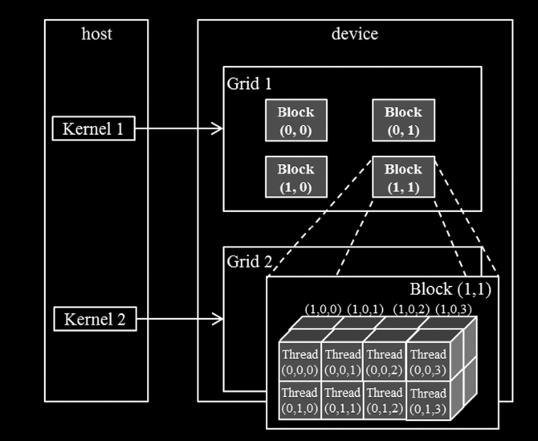
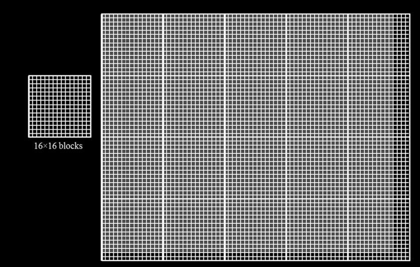
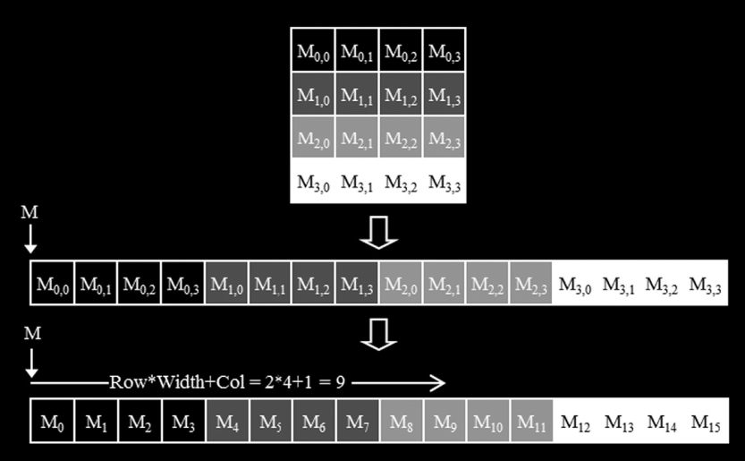
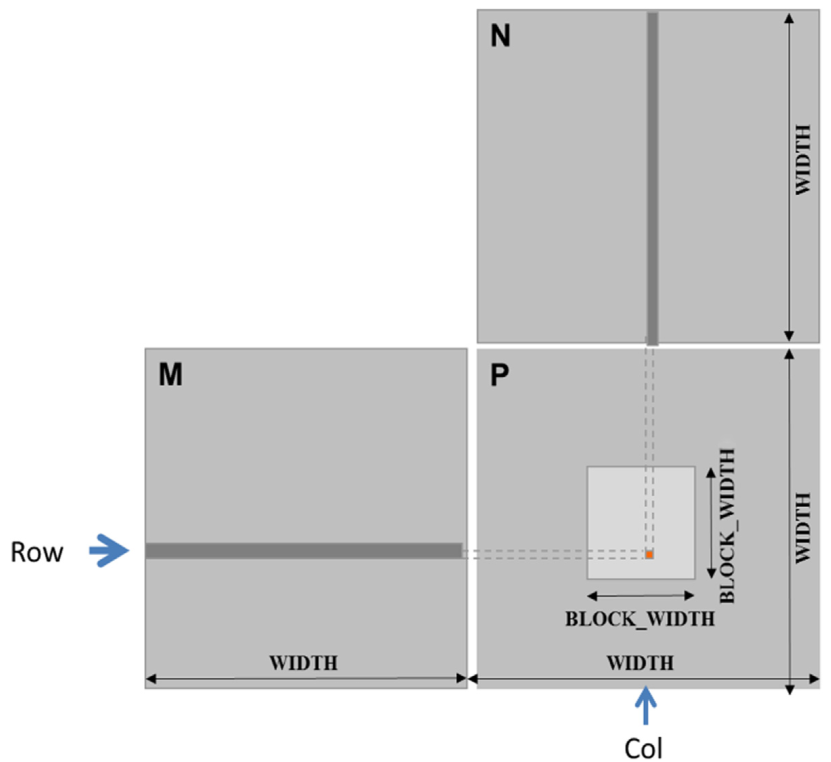

## Understanding CUDA Grids and Blocks

*   Think of a CUDA grid as a multi-dimensional array (up to 3D) of blocks.
*   Each block is itself a multi-dimensional array (up to 3D) of threads.
*   The execution configuration parameters for launching a kernel (e.g., `<gridDim, blockDim>`) use the built-in `dim3` type to specify the dimensions of the grid and blocks.
*   Once a grid is launched, its dimensions (`gridDim`) and the dimensions of its blocks (`blockDim`) remain fixed until the entire grid finishes execution.
*   Within a kernel, `gridDim` and `blockDim` are built-in variables that reflect the dimensions of the launched grid and blocks, respectively.

### CUDA Grid and Block Dimensions and Limits

*   In CUDA C, the allowed values for grid dimensions are:
    *   `gridDim.x` ranges from 1 to $2^{31}-1$
    *   `gridDim.y` and `gridDim.z` range from 1 to $2^{16}-1$ (65,535)
*   All threads within a single block share the same `blockIdx.x`, `blockIdx.y`, and `blockIdx.z` values.
*   The `blockIdx` variable for a given block indicates its position within the grid, with indices ranging from 0 up to `gridDim` minus 1 in each dimension:
    *   `blockIdx.x`: [0, `gridDim.x`-1]
    *   `blockIdx.y`: [0, `gridDim.y`-1]
    *   `blockIdx.z`: [0, `gridDim.z`-1]
*   Each block is organized as a 3D array of threads.
*   You can create 2D blocks by setting `blockDim.z` to 1 in the execution configuration.
*   Similarly, 1D blocks can be created by setting both `blockDim.y` and `blockDim.z` to 1.
*   All blocks within the same grid launch have identical dimensions and total thread counts.
*   The kernel's execution configuration (`gridDim` and `blockDim`) is accessible from within the kernel itself. For example, `blockDim.x`, `blockDim.y`, and `blockDim.z` provide the number of threads in the x, y, and z dimensions of the block.
*   The **total number of threads per block** is currently limited to 1024 on most modern CUDA-enabled GPUs.
*   You can distribute these threads across the three dimensions (`blockDim.x`, `blockDim.y`, `blockDim.z`) as long as their product (`blockDim.x * blockDim.y * blockDim.z`) does not exceed the total limit (e.g., 1024) and each individual dimension is within hardware limits (which are typically much larger than the total limit, but `blockDim.z` often has a smaller limit like 64).
*   A grid and its blocks do not necessarily have the same dimensionality (e.g., a 2D grid can contain 1D blocks, or a 1D grid can contain 3D blocks).
*   Consider an example with `gridDim = (2, 2, 1)` and `blockDim = (4, 2, 2)`. This means the grid is 2 blocks wide (x), 2 blocks high (y), and 1 block deep (z). Each block contains 4 threads in the x-direction, 2 threads in the y-direction, and 2 threads in the z-direction.
    
    *   *Note:* While the visualization might label blocks using `(y, x)` or other conventions for visual clarity, the built-in CUDA variable `blockIdx` always refers to the block's index as `(x, y, z)`. So, `blockIdx.x` is the index in the grid's x-dimension, `blockIdx.y` in the grid's y-dimension, and `blockIdx.z` in the grid's z-dimension.

### Mapping Threads to Multidimensional Data

*   The choice of 1D, 2D, or 3D organization for your grid and blocks often depends on the inherent structure of the data you are processing.
*   For example, when processing images, it is common and often suitable to use a 2D grid composed of 2D blocks, mirroring the 2D nature of the image data.
    
*   Each thread is assigned responsibility for processing a specific element (like a pixel) in the multidimensional data. The unique global coordinates of this element can be derived from the thread's block index (`blockIdx`), block dimensions (`blockDim`), and its index within the block (`threadIdx`).
*   For a 2D grid and 2D blocks mapping to a 2D image, the global coordinates (`y`, `x`) for the pixel processed by a specific thread (`threadIdx.x`, `threadIdx.y`) in block (`blockIdx.x`, `blockIdx.y`) are calculated as:
    *   Vertical (row) coordinate: `y = blockIdx.y * blockDim.y + threadIdx.y`
    *   Horizontal (column) coordinate: `x = blockIdx.x * blockDim.x + threadIdx.x`
*   The data element (pixel) `P_in(y, x)` processed by this thread can be accessed using these coordinates. For instance, the thread with `threadIdx=(0,0)` in block `blockIdx=(1,0)` (assuming standard x, y ordering for both) would target the element at:
    $$P_{in}(y,x) = P_{in}(blockIdx.y \cdot blockDim.y + threadIdx.y, \quad blockIdx.x \cdot blockDim.x + threadIdx.x)$$
    Plugging in the example values: $P_{in}(0 \cdot \text{blockDim.y} + 0, \quad 1 \cdot \text{blockDim.x} + 0) = P_{in}(0, \quad \text{blockDim.x})$.
*   When writing a kernel that processes data based on calculated global indices, it is crucial to include boundary checks. You must verify that the calculated `x`, `y`, (and `z`) indices fall within the actual dimensions of the data structure (e.g., image width and height). This is necessary if the grid and block dimensions don't perfectly match the data size or if the data size is not a multiple of the block size.
*   The host code is typically responsible for knowing the dimensions of the data (like the number of pixels in the y and x directions) and often passes these dimensions to the kernel.

### Linearizing Multidimensional Arrays in Memory

*   Multidimensional arrays (like 2D or 3D arrays) must be mapped to a linear, 1D sequence of memory addresses when stored in computer memory or transferred to the GPU.
*   **Row-Major Format:** A common linearization strategy where elements of each row are placed consecutively in memory. The rows are then placed one after another.
    

*   **Column-Major Format:** An alternative where elements of each column are placed consecutively in memory. The columns are then placed one after another.

### Accessing 3D Arrays

*   Linearizing a 3D array involves extending the 2D concepts. A common method is to place each 'plane' (or slice along one dimension) of the array one after another in memory, and within each plane, use a 2D linearization (like row-major).
*   For a 3D array `P` with dimensions `[Depth][Height][Width]`, typically accessed by indices `(depth_idx, row_idx, col_idx)`, the linearized index assuming a row-major-like layout (planes, then rows, then columns) is:
    `linear_index = depth_idx * Height * Width + row_idx * Width + col_idx`
*   Using the global indices calculated from `blockIdx` and `threadIdx`:
    *   `int depth_idx = blockIdx.z * blockDim.z + threadIdx.z;`
    *   `int row_idx = blockIdx.y * blockDim.y + threadIdx.y;`
    *   `int col_idx = blockIdx.x * blockDim.x + threadIdx.x;`
*   The element `P[depth_idx][row_idx][col_idx]` in the 3D array can be accessed in its linearized form using the index:
    `P[depth_idx * Height * Width + row_idx * Width + col_idx]`
    *   *Note:* Here, `Height` and `Width` refer to the dimensions of the *actual* 3D array being accessed.
*   As with 2D data, it is essential to include boundary checks to confirm that the calculated `depth_idx`, `row_idx`, and `col_idx` fall within the valid dimensions of the 3D array before accessing memory.

### Beyond Independent Threads: Thread Cooperation

*   The examples so far focused on threads performing independent operations on distinct data elements. However, many real-world problems require threads to cooperate to perform more complex tasks.
*   Cooperation typically happens among threads within the same block. This is facilitated by shared memory (fast on-chip memory visible to all threads in a block) and thread synchronization (`__syncthreads()`).

### Example: Matrix Multiplication

*   Matrix multiplication `C = A * B`, where `A` is an `M x K` matrix and `B` is a `K x N` matrix, results in a `C` matrix of size `M x N`.
*   Each element `C[i][j]` is computed as the dot product of the i-th row of `A` and the j-th column of `B`. For this to be possible, the number of columns in `A` (`K`) must equal the number of rows in `B` (`K`).
*   A common strategy for mapping matrix multiplication to CUDA is to assign each thread the task of computing a single element in the output matrix `C`.
*   The global row and column indices (`row`, `col`) for the element `C[row][col]` calculated by a specific thread are derived from its `blockIdx` and `threadIdx`, similar to the 2D image mapping:
    *   `row = blockIdx.y * blockDim.y + threadIdx.y`
    *   `col = blockIdx.x * blockDim.x + threadIdx.x`
*   Using this mapping, each block is responsible for computing a specific sub-matrix (or tile) of the output matrix `C`.
    
    
*   Input matrices `A` and `B`, and the output matrix `C`, must be linearized into 1D arrays when transferred to the device. A typical approach is row-major order.
*   If the dimensions of the output matrix `C` are larger than what a single grid can address using the element-per-thread mapping (i.e., `M > gridDim.y * blockDim.y` or `N > gridDim.x * blockDim.x`), you have a few options:
    *   **Host-Driven Tiling:** On the host side, divide the output matrix `C` into smaller sub-matrices (tiles). For each tile, launch a separate grid configuration that is sized to cover that tile.
    *   **Kernel Iteration:** Design the kernel so that each thread calculates multiple elements of the output matrix `C`. This is typically done by having each thread step through a portion of the output matrix, often by adding `gridDim.y * blockDim.y` (for rows) or `gridDim.x * blockDim.x` (for columns) in a loop.

### Summary

*   CUDA grids and blocks provide a flexible, multi-dimensional hierarchy (up to three dimensions) for organizing threads.
*   The multi-dimensionality of grids and blocks is highly effective for mapping threads to elements in multi-dimensional data structures like images or volumes.
*   The dimensions of a grid and its blocks are defined by the kernel execution configuration parameters (`gridDim` and `blockDim`).
*   Threads can uniquely identify themselves within this hierarchy using the built-in `blockIdx` and `threadIdx` variables, allowing them to determine which data element(s) they are responsible for processing.

---