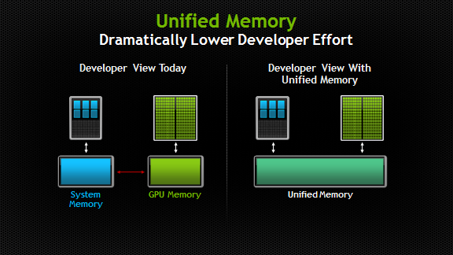
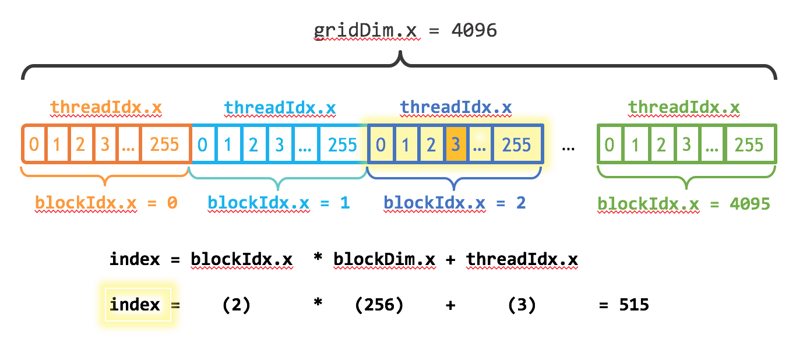

# ADD
* Functions with the `__global__` specifier are called Kernels.
* Code within kernels is referred to as 'device code'.

#### Unified Memory

Unified memory eliminates the need to manage separate memory spaces for the CPU and GPU. Instead of allocating and copying data between distinct CPU and GPU memories, unified memory provides a shared pool of managed memory.

* This managed memory is accessible to both the CPU and GPU using a single pointer.
* Data is automatically migrated between CPU and GPU as needed.
* To allocate data in unified memory, use `cudaMallocManaged()`. This function returns a pointer accessible from both host (CPU) and device (GPU).
* To free unified memory, use `cudaFree()` and pass the pointer as an argument.

##### Important Considerations for Unified Memory

* **Synchronization:** Before the CPU accesses data in unified memory that has been modified by a kernel, it's crucial to ensure the kernel has finished execution. Use `cudaDeviceSynchronize()` to make the CPU wait until all preceding CUDA calls, including kernel launches, have completed. This prevents race conditions and ensures data consistency.

#### Execution Configuration Details

* CUDA GPUs execute kernels using blocks of threads, where each block size is a multiple of 32.
* For effective parallelism within a kernel, you need to determine the indices of running threads and assign them corresponding tasks within the global data pool.

##### Key Built-in Variables for Thread Indexing

* `threadIdx.x`: Represents the index of the current thread *within* its block.
* `blockDim.x`: Represents the total number of threads *in* the block.

#### Streaming Multiprocessors (SMs)

* CUDA GPUs contain multiple parallel processors grouped into Streaming Multiprocessors (SMs).
* Each SM can concurrently run multiple thread blocks.
* Blocks of parallel threads are organized into a 'grid'.

    

* `gridDim` provides the number of blocks in the grid.
* Each GPU consists of multiple SMs.