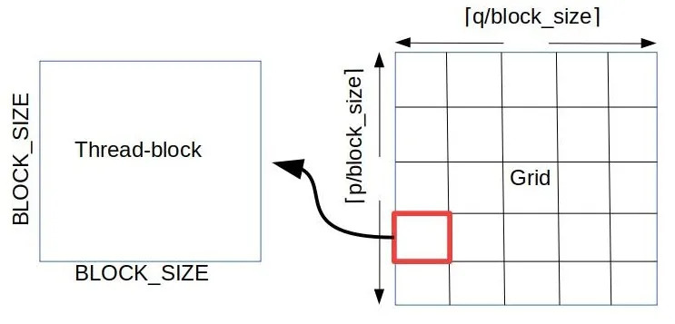
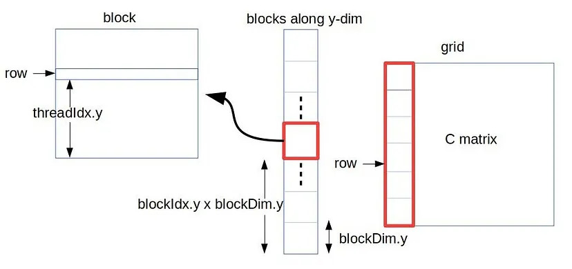
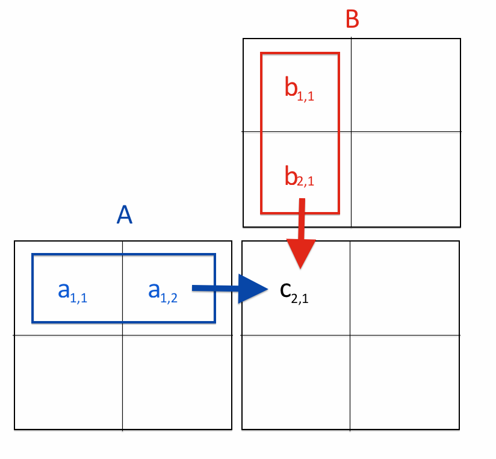

* New Concepts: 
1. Multi-dimensional thread blocks:
   To visualize the layout of a 2D grid and 2D blocks, observe the following two figures:
   
   

* Each element of matrix C is independent of the others in computation, as you can observe in the following figure:
   

* Grids and blocks are 3D arrays of blocks and grids, respectively. 

* By default, if you do not specify the `blocksPerGrid` or `threadsPerBlock` as 3D arrays in the kernel execution configuration, they are assumed to be `dim3` mono-dimensional variables with y and z set to 1. 

        dim3 blocksPerGrid(512, 1, 1);
        dim3 threadsPerBlock(512, 1, 1);

* How to index into a multi-dimensional thread block: 

        int row = blockIdx.y * blockDim.y + threadIdx.y;
        int col = blockIdx.x * blockDim.x + threadIdx.x;

* To my knowledge, the total number of threads in a single block cannot exceed 1024. Therefore, it becomes very important to distribute threads among all the dimensions in the block.

    [✓] dim3 threadsPerBlock(1024, 1, 1)

    [✓] dim3 threadsPerBlock(512, 2, 1)

    [X] dim3 threadsPerBlock(256, 3, 2)

* The easiest way to implement matrix multiplication (MatMul) is to let each thread perform a vector-vector multiplication. Each element in matrix C will be calculated separately by a single thread.

* There will be M*K threads, each computing one (i,j) value of matrix C. 

* Threads are arranged in 2D thread blocks within a 2D grid. 

* Visualize matrix C as overlaid on top of the grid of blocks (rows/columns of blocks).

* To access element (i,j) in a matrix stored in row-major format, use the formula: M[i * width + j].

* `A[row * width + q]`: This means to access the element at row 'row' and column 'q' (iterating over the columns retrieves all values in the row).

* `B[q * K + col]`: This means to access the element at row 'q' and column 'col' (iterating over the rows retrieves all values in the column).